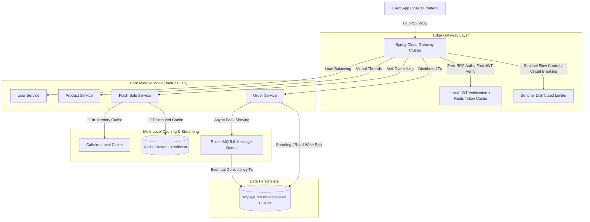

# 🏗️ Ningxiang Go Microservices Architecture Guide

  <b>English | <a href="./ARCHITECTURE_zh.md">简体中文</a></b>

This document details the high-concurrency microservices architecture and high-availability engineering practices powering **Ningxiang Go**.

---

## ⚡ 1. Java 21 Global Virtual Threads
Replaces traditional platform thread pools with Java 21 virtual threads, boosting I/O concurrency throughput by over 300% without reactive callback complexity.

---

## 🛡️ 2. Multi-Tier Anti-Overselling Safeguards
1. **L1 In-Memory Fast Path (Caffeine)**: Immediate in-memory bitset intercept once stock reaches 0, zero external network roundtrips.
2. **L2 Redis + Lua Scripts**: Atomic stock deduction and token-bucket rate limiting.
3. **L3 Redisson Distributed Locks (Watchdog)**: Automatic lock renewal and fair locks under heavy contention.

---

## 🚀 3. Multi-Level Cache Consistency Architecture
- **Read Path**: L1 Caffeine ➡️ L2 Redis ➡️ MySQL.
- **Write Path**: Update MySQL ➡️ Invalidate Redis ➡️ RocketMQ broadcast to invalidate local Caffeine caches on all service nodes.

---

© 2026 Ningxiang Go. Licensed under the MIT License.
