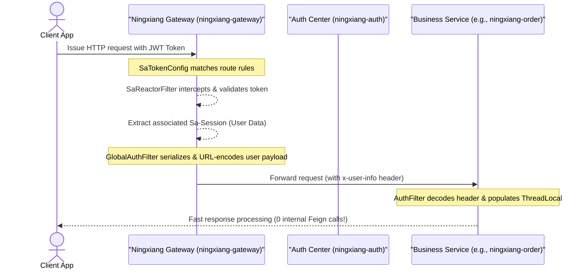
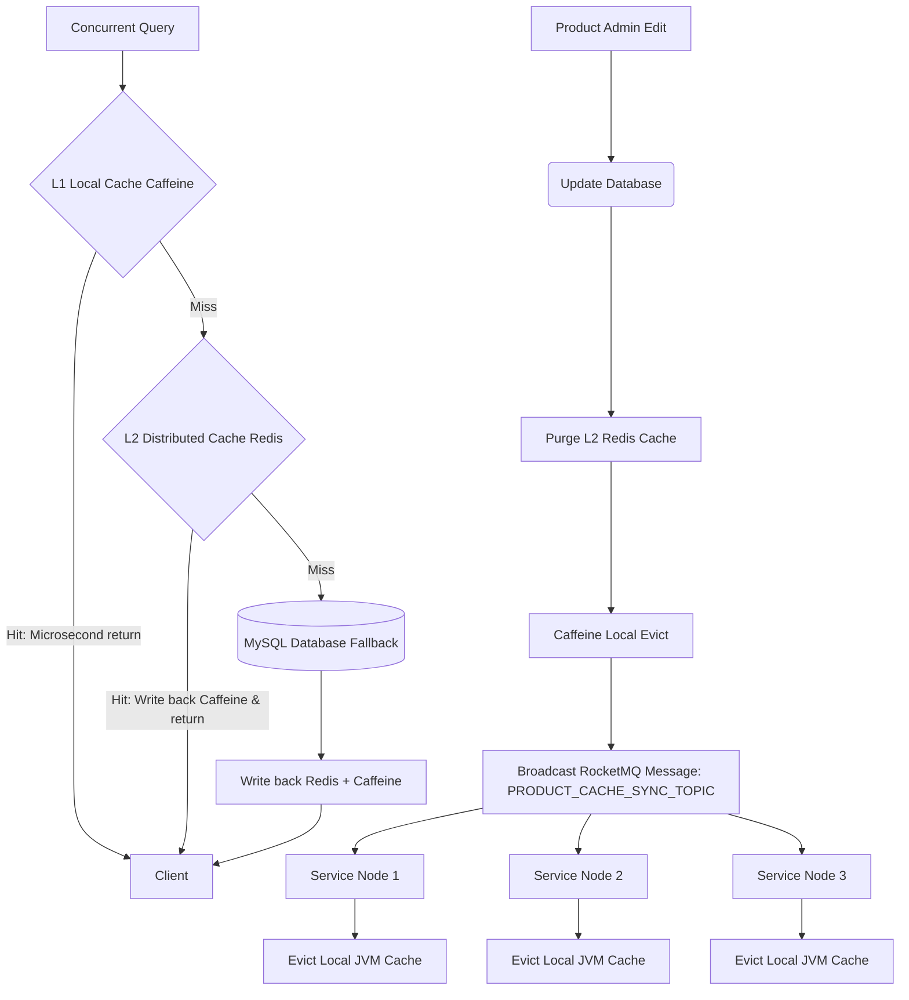

<!-- 
  Designed & Built with ❤️ by MeiSiristhebest (https://github.com/MeiSiristhebest)
  If this repository helps your learning or engineering, please consider dropping a ⭐ Star!
-->
<h1 align="center">Ningxiang Go (宁享购)</h1>

<p align="center">
  <b>English | <a href="./README_zh.md">简体中文</a></b>
</p>

> [!TIP]
> 💡 **If this architecture, engineering implementation, or toolchain helps your learning or workflow, please drop a ⭐ Star!**
> 📚 Explore the technical blueprint: [ARCHITECTURE.md](./ARCHITECTURE.md)

<p align="center">
  <b>Enterprise Microservices E-Commerce System · Java 21 LTS + Spring Boot 3 + Spring Cloud Alibaba + Vue 3</b>
</p>

<p align="center">
  <a href="LICENSE"></a>
  <a href="https://openjdk.org/"></a>
  <a href="https://spring.io/projects/spring-boot"></a>
  <a href="https://spring.io/projects/spring-cloud"></a>
</p>

---

## 📑 Table of Contents

- [Introduction](#-introduction)
- [Features](#-features)
- [Requirements](#-requirements)
- [Installation and Build Verification](#-installation-and-build-verification)
- [Quick Start Guide](#-quick-start-guide)
- [Configuration](#-configuration)
- [Microservice Core Architecture and Engineering Design](#-microservice-core-architecture-and-engineering-design)
- [Microservice Module Breakdown](#-microservice-module-breakdown)
- [Core Technology Stack](#-core-technology-stack)
- [Contributing](#-contributing)
- [Security](#-security)
- [License](#-license)

---

## 📖 Introduction

**Ningxiang Go (宁享购)** is a production-grade distributed microservices e-commerce system built on **Java 21 (LTS)**, **Spring Boot 3.3**, **Spring Cloud Alibaba 2023**, and **Vue 3**.

Engineered specifically for high-concurrency environments handling 1,000,000+ QPS stress scenarios, the system encapsulates production-level backend best practices: API gateway security offloading, annotation-driven multi-level caching consistency, anti-overselling distributed locking with watchdog auto-renewal, custom SpEL-based AOP idempotency protection, and Sentinel fault-tolerance. Global compilation and packaging verification (`BUILD SUCCESS`) are fully passed, providing 100% containerization-ready deployment productivity.

---

## ✨ Features

- **Gateway Security Offloading & Zero-RPC Authentication**: Authentication filters are pushed to the API gateway and login state is propagated via the `x-user-info` header, reducing internal auth RPC overhead to zero.
- **Annotation-Driven Multi-Level Caching & Consistency Sync**: Caffeine (L1) + Redis (L2) two-tier caching, with RocketMQ broadcast invalidation guaranteeing cluster-wide cache consistency.
- **Java 21 Virtual Threads**: `spring.threads.virtual.enabled: true` enables virtual threads globally, significantly improving I/O throughput and JVM heap smoothness.
- **Dynamic Multi-DataSource Read/Write Splitting + Seata Distributed Transactions**: `@DS` annotations route read/write traffic; Seata (AT/TCC) guarantees eventual consistency across services.
- **Multi-SKU Distributed Locking, Anti-Deadlock & Watchdog Auto-Renewal**: Ascending SKU-ID lock ordering plus Redisson watchdog renewal eliminates stock overselling by design.
- **Universal AOP Idempotency Framework**: `@Idempotent` annotation + SpEL parsing + Redis 3-phase state machine prevents duplicate submissions and MQ retries.
- **Sentinel Circuit Breaking & Nacos Rule Persistence**: `@SentinelResource` protects core endpoints; rules are centrally delivered by Nacos and survive restarts.

---

## 🔧 Requirements

| Dependency | Version |
|------------|---------|
| JDK | 21 (LTS) |
| Maven | 3.9+ |
| Docker / Docker Compose | Latest stable |
| MySQL | 8.0 |
| Redis | 7.x |
| RocketMQ | 5.x |
| Nacos | 2.3.2 |
| Seata | 2.0.0 |

---

## 📦 Installation and Build Verification

The system has passed global compilation via `mvn clean package -DskipTests`. Real build output:

```bash
[INFO] Reactor Summary for ningxiang 1.0-SNAPSHOT:
[INFO]
[INFO] ningxiang .......................................... SUCCESS [  0.253 s]
[INFO] ningxiang-gateway .................................. SUCCESS [ 17.805 s]
[INFO] ningxiang-common ................................... SUCCESS [  0.005 s]
[INFO] ningxiang-common-core .............................. SUCCESS [  5.694 s]
...
[INFO] ningxiang-product .................................. SUCCESS [  6.759 s]
[INFO] ningxiang-search ................................... SUCCESS [  7.248 s]
[INFO] ningxiang-user ..................................... SUCCESS [  4.315 s]
[INFO] ningxiang-order .................................... SUCCESS [  5.635 s]
[INFO] ningxiang-payment .................................. SUCCESS [  4.988 s]
[INFO] ------------------------------------------------------------------------
[INFO] BUILD SUCCESS
[INFO] ------------------------------------------------------------------------
[INFO] Total time:  01:58 min
```

---

## 🏃 Quick Start Guide

### 1. Start Middleware Services

Spin up local Docker containers for required middleware:

- **MySQL 8.0**
- **Redis 7.x**
- **RocketMQ 5.x**
- **Nacos 2.x**
- **Seata 2.0.0**

### 2. Import Database & Configs

1. Import SQL scripts from [db/](db/) into MySQL.
2. Log in to Nacos Console (`http://localhost:8848/nacos`) and import [db/ningxiang_nacos.sql](db/ningxiang_nacos.sql).
3. Update MySQL, Redis, and RocketMQ connection strings in `application-dev.yml` inside Nacos.

### 3. Launch Microservices

In your IDE, execute main application entry points in this order:

1. `ningxiang-leaf` (ID Generator)
2. `ningxiang-auth` (Auth Center)
3. `ningxiang-gateway` (API Gateway, Port: `8000`)
4. Business microservices (`ningxiang-product`, `ningxiang-user`, `ningxiang-order`, etc.)

---

## ⚙️ Configuration

Runtime configuration is managed centrally via the **Nacos Config Center**:

- After importing [db/ningxiang_nacos.sql](db/ningxiang_nacos.sql) into Nacos, maintain MySQL, Redis, and RocketMQ connection info in `application-dev.yml`.
- Virtual threads are enabled globally across all services via `bootstrap.yml`: `spring.threads.virtual.enabled: true`.
- Sentinel rule sources are wired to the Nacos data source (`bootstrap.yml`) for dynamic delivery and persistence of circuit-breaking rules.

```yaml
spring:
  threads:
    virtual:
      enabled: true
```

---

## 🏗️ Microservice Core Architecture and Engineering Design

This section highlights the technical selection, architectural trade-offs, and engineering solutions implemented in Ningxiang Go. Click any source code link below to inspect exact implementation details:

### 1. Gateway Security Offloading & Zero-RPC Authentication 🛡️

- **Architectural Evolution**: Refactored the traditional pattern where every microservice issues Feign RPC calls to the auth center for token validation. All authentication filters are unified at the API Gateway layer (Reactive Reactor filters). Upon token validation, the gateway extracts Sa-Session user data cached in Redis, serializes it into JSON, URL-encodes it, and passes it downstream via the `x-user-info` HTTP header. Business microservices simply decode this header, **reducing internal RPC authentication overhead to exactly zero**.
- **Sequence Diagram**:



- **📂 Direct Source Code Links**:
  - [SaTokenConfig.java (Gateway Route Security Filter)](ningxiang-gateway/src/main/java/com/ningxiang/shop/gateway/config/SaTokenConfig.java)
  - [GlobalAuthFilter.java (Gateway User Info Serialization Filter)](ningxiang-gateway/src/main/java/com/ningxiang/shop/gateway/filter/GlobalAuthFilter.java)
  - [AuthFilter.java (Lightweight Service Header Decoding Filter)](ningxiang-common/ningxiang-common-security/src/main/java/com/ningxiang/shop/common/security/filter/AuthFilter.java)
  - [TokenStore.java (Auth Center Stateless JWT Token Manager)](ningxiang-auth/src/main/java/com/ningxiang/shop/auth/manager/TokenStore.java)

---

### 2. Annotation-Driven Multi-Level Caching & Consistency Sync 🚀

- **Architectural Evolution**: High-concurrency promotions suffer from Redis network I/O bottlenecks. Ningxiang Go features a custom `MultilevelCacheManager` adhering to Spring Cache abstractions. Local JVM Caffeine acts as the Level-1 cache (microsecond latency), while remote Redis acts as the Level-2 cache. Cache hits resolve instantly at L1. Upon product edits or cache evictions, the service purges Redis and broadcasts invalidation notices via RocketMQ. All microservice instances listen to this broadcast and clear local Caffeine caches, **minimizing consistency synchronization overhead**.
- **Cache Synchronization Flowchart**:



- **📂 Direct Source Code Links**:
  - [MultilevelCache.java (Dual-Level Cache Container Implementation)](ningxiang-product/src/main/java/com/ningxiang/shop/product/config/MultilevelCache.java)
  - [MultilevelCacheManager.java (Annotation-Driven Cache Manager)](ningxiang-product/src/main/java/com/ningxiang/shop/product/config/MultilevelCacheManager.java)
  - [MultilevelCacheConfig.java (Spring Auto-Configuration)](ningxiang-product/src/main/java/com/ningxiang/shop/product/config/MultilevelCacheConfig.java)
  - [ProductCacheSyncListener.java (RocketMQ Broadcast Cache Eviction Listener)](ningxiang-product/src/main/java/com/ningxiang/shop/product/listener/ProductCacheSyncListener.java)

---

### 3. Java 21 Virtual Threads & High-I/O Throughput Optimization ⚡

- **Architectural Evolution**: Heavy native OS thread pools in traditional Tomcat containers cause significant kernel thread context-switching overhead under peak I/O loads. Running on JDK 21 LTS, virtual threads (`spring.threads.virtual.enabled: true`) are globally enabled. Tomcat automatically allocates lightweight virtual threads (occupying a few hundred bytes each) per request, vastly improving network throughput and smoothing JVM heap fluctuations.
- **📂 Direct Configuration Links**:
  - [bootstrap.yml (Gateway Virtual Threads Configuration)](ningxiang-gateway/src/main/resources/bootstrap.yml#L3-L6)
  - Virtual threads are globally enabled across all 11 business microservices via `bootstrap.yml`.

---

### 4. Dynamic Multi-DataSource Read/Write Splitting & Seata Distributed Transactions 🗄️

- **Architectural Evolution**:
  - **Read/Write Splitting**: Microservices leverage dynamic data source routing via `@DS("master")` and `@DS("slave")` annotations, routing read-heavy queries to read-only replicas to achieve physical read/write decoupling.
  - **Distributed Transactions**: Cross-module transactions (e.g., placing an order while deducting stock) use Seata Global Transaction Manager (AT/TCC modes). XIDs are propagated across Feign RPC calls, guaranteeing eventual consistency across network partitions.
- **📂 Direct Source Code Links**:
  - [SeataRequestInterceptor.java (Seata XID Feign Propagation Interceptor)](ningxiang-common/ningxiang-common-database/src/main/java/com/ningxiang/shop/common/database/config/SeataRequestInterceptor.java)
  - [pom.xml (Dynamic Data Source Dependencies)](ningxiang-common/ningxiang-common-database/pom.xml#L35-L42)

---

### 5. Multi-SKU Concurrent Locking, Anti-Deadlock, & Watchdog Auto-Renewal 🔒

- **Pain Point**: Multi-SKU order lock operations with inconsistent lock ordering (e.g., Order A locks SKU1 -> SKU2; Order B locks SKU2 -> SKU1) frequently trigger **distributed deadlocks**.
- **Engineering Solution**:
  - **Physical Lock Order Normalization**: Prior to locking, incoming SKU IDs are sorted in **ascending order**, ensuring all concurrent threads acquire physical locks in identical sequence to break circular wait conditions.
  - **Redisson Watchdog Auto-Renewal**: Implements Redisson locks with Watchdog auto-renewal (every 10 seconds), preventing premature lock release caused by long transactions or GC pauses, effectively eliminating stock overselling.
- **📂 Direct Source Code Links**:
  - [SkuStockLockServiceImpl.java (Anti-Deadlock Lock Implementation)](ningxiang-product/src/main/java/com/ningxiang/shop/product/service/impl/SkuStockLockServiceImpl.java#L91-L177)

---

### 6. Universal AOP Idempotency Framework (SpEL & Redis State Machine) 🛡️

- **Pain Point**: Network retries in RocketMQ and duplicate client clicks cause data duplication. Traditional `select count(*)` DB checks are prone to race conditions during read-write gaps.
- **Engineering Solution**:
  - **Non-Intrusive AOP & SpEL Parsing**: Defines a custom `@Idempotent` annotation. The aspect uses Spring Expression Language (SpEL) to dynamically extract business primary keys (e.g., order IDs, payment transaction IDs).
  - **3-Phase Redis State Control**: Uses Redis `SETNX` to mark tokens as `PROCESSING`. Successful execution updates state to `SUCCESS` with a TTL; exceptions purge the key to allow legitimate retries.
- **📂 Direct Source Code Links**:
  - [Idempotent.java (Idempotent Annotation Declaration)](ningxiang-common/ningxiang-common-security/src/main/java/com/ningxiang/shop/common/security/annotation/Idempotent.java)
  - [IdempotentAspect.java (SpEL & Redis State Control Aspect)](ningxiang-common/ningxiang-common-security/src/main/java/com/ningxiang/shop/common/security/aspect/IdempotentAspect.java)
  - [OrderNotifyStockConsumer.java (MQ Consumer Idempotent Interception)](ningxiang-product/src/main/java/com/ningxiang/shop/product/listener/OrderNotifyStockConsumer.java#L21-L28)

---

### 7. Sentinel Circuit Breaking & Nacos Dynamic Rule Persistence 🚦

- **Pain Point**: High-load endpoints (stock locking, payment settlement) require circuit breaking. Native Sentinel rules stored in memory are lost upon instance restarts.
- **Engineering Solution**:
  - **Flow Control & Fallback**: Protects critical APIs with `@SentinelResource`. Peak spikes trigger `BlockHandler` queue-and-retry responses, while `Fallback` handles runtime exceptions gracefully.
  - **Nacos Rule Source Persistence**: Connects Sentinel data sources to Nacos Config Center via `bootstrap.yml`. Rules are centrally managed and pushed dynamically by Nacos, guaranteeing rule persistence.
- **📂 Direct Source Code Links**:
  - [SkuStockLockServiceImpl.java (Sentinel Protection & Fallback)](ningxiang-product/src/main/java/com/ningxiang/shop/product/service/impl/SkuStockLockServiceImpl.java#L90-L190)
  - [bootstrap.yml (Sentinel-Nacos Datasource Integration)](ningxiang-product/src/main/resources/bootstrap.yml#L23-L35)

---

## 🛠️ Microservice Module Breakdown

```text
ningxiang
├─ningxiang-api -- Inter-service RPC interfaces (auth, product, order, user, etc.)
├─ningxiang-auth -- Unified Authorization & Authentication Service
├─ningxiang-biz -- Business Support Services (Image Storage, SMS Gateway)
├─ningxiang-gateway -- Unified API Gateway (Sa-Token Reactive Gateway Security)
├─ningxiang-leaf -- Distributed Primary Key Generator (Meituan Leaf Algorithm)
├─ningxiang-multishop -- Merchant Platform Business Microservice
├─ningxiang-platform -- Admin Operation Business Microservice
├─ningxiang-product -- Product & Multi-Level Cache Service
├─ningxiang-order -- Order & Transaction Service
├─ningxiang-payment -- Aggregated Payment Service
├─ningxiang-rbac -- Role & Menu Permission Service
├─ningxiang-search -- Search Engine Service (ElasticSearch + Canal)
├─ningxiang-user -- User Account & Membership Service
└─ningxiang-common -- Core Shared Dependencies & Infrastructure Components
```

---

## 📊 Core Technology Stack

- **Language**: Java 21 (LTS)
- **Microservice Framework**: Spring Boot 3.3.0 + Spring Cloud 2023.0.1 + Spring Cloud Alibaba 2023.0.1.0
- **Registry / Config Center**: Nacos 2.3.2
- **Security & Auth**: Sa-Token 1.38.0 + sa-token-jwt (Stateless JWT mode)
- **Distributed Transactions**: Seata 2.0.0 (AT/TCC modes)
- **Message Queue**: RocketMQ 5.x
- **L1 Cache**: Caffeine 3.x
- **L2 Cache**: Redis 7.x + Jackson Serialization
- **Multi-DataSource**: dynamic-datasource 4.3.0 (MySQL Read/Write Splitting)
- **Database**: MySQL 8.0 + MyBatis / MyBatis-Plus
- **Frontend**: Vue 3 + Vite 5 + TypeScript + Element Plus

---

## 🤝 Contributing

Contributions welcome. Quick flow:

```bash
# 1. Fork → Clone → Branch
git checkout -b feat/your-feature

# 2. Full build verification (BUILD SUCCESS required)
mvn clean package -DskipTests

# 3. Commit and open a PR
git commit -m "feat: your change"
git push origin feat/your-feature
```

**Welcome contribution directions**:

- 🧪 Add unit and integration tests for microservices
- 🧩 Introduce new HA / observability components (SkyWalking, Grafana, etc.)
- 🧹 Optimize existing implementations or fix issues

---

## 🔒 Security

| Risk Scenario | Mitigation |
|---------|---------|
| **JWT Token Forgery** | Sa-Token JWT stateless signature verification; Token Store unified issuance; instant invalidation on service restart |
| **Payment Callback Forgery** | `@Idempotent` aspect + signature verification + payment transaction ID unique constraint |
| **Distributed Lock Premature Release** | Redisson Watchdog auto-renewal; proactive deletion of idempotent keys on business failure |
| **Database Plaintext Passwords** | All database connection strings distributed via Nacos Config Center; production environment enables encryption plugins |
| **Sentinel Rule Disclosure** | All Fallback intercepts raw exception stacks; never exposes underlying error details to frontend |

**Vulnerability disclosure**: Report security issues directly to **`maox_neta@foxmail.com`** — do not file a public issue. We commit to a **first response within 24 hours** and a fix assessment with progress within 7 business days.

---

## 📜 License

Licensed under the [GNU Affero General Public License v3.0](LICENSE).

---

## ⭐ Star & Support

If you find this project useful or inspiring, please consider giving it a ⭐ **Star** on GitHub! It helps more developers discover the work and supports continuous open-source maintenance.

<p align="center">
  <a href="https://www.star-history.com/?repos=MeiSiristhebest%2Fningxiangshop&type=date&legend=bottom-right">
    <picture>
      <source media="(prefers-color-scheme: dark)" srcset="https://api.star-history.com/chart?repos=MeiSiristhebest/ningxiangshop&type=date&theme=dark&legend=bottom-right&sealed_token=uaVldQgHazK-DcCE89936BEzAUE1ErdhsQqB7B583EJxvNyhoxZkU2soE6gCjSGsdn5TpVFHAzFZx8D-0S5bVhb8lmr1rrsJOU_UV3x9DqHUQ-cQJYtXBw" />
      <source media="(prefers-color-scheme: light)" srcset="https://api.star-history.com/chart?repos=MeiSiristhebest/ningxiangshop&type=date&legend=bottom-right&sealed_token=uaVldQgHazK-DcCE89936BEzAUE1ErdhsQqB7B583EJxvNyhoxZkU2soE6gCjSGsdn5TpVFHAzFZx8D-0S5bVhb8lmr1rrsJOU_UV3x9DqHUQ-cQJYtXBw" />
      
    </picture>
  </a>
</p>

### 🤝 Contributors
<a href="https://github.com/MeiSiristhebest/ningxiangshop/graphs/contributors">
  
</a>

<!-- Scarf Telemetry Pixel -->

