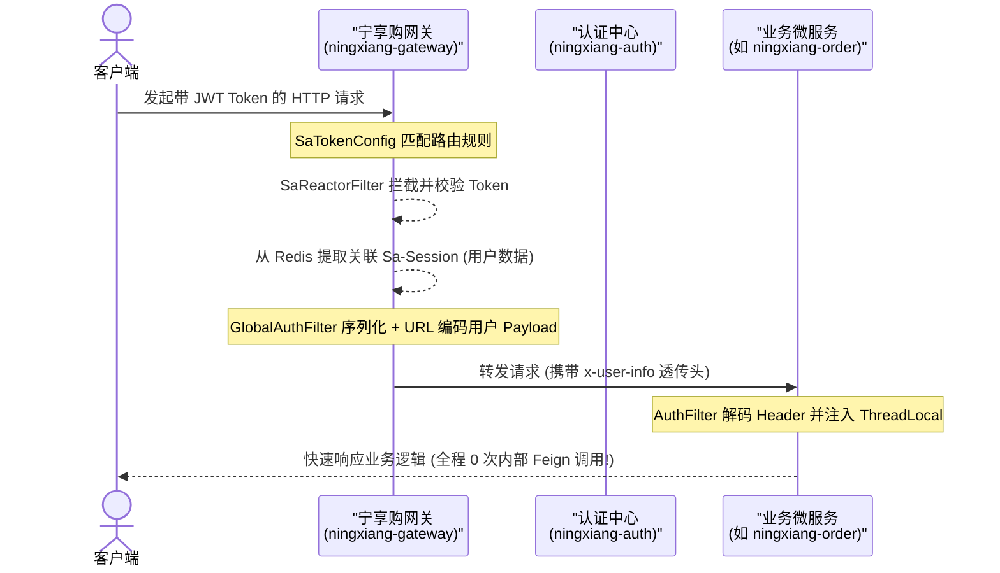
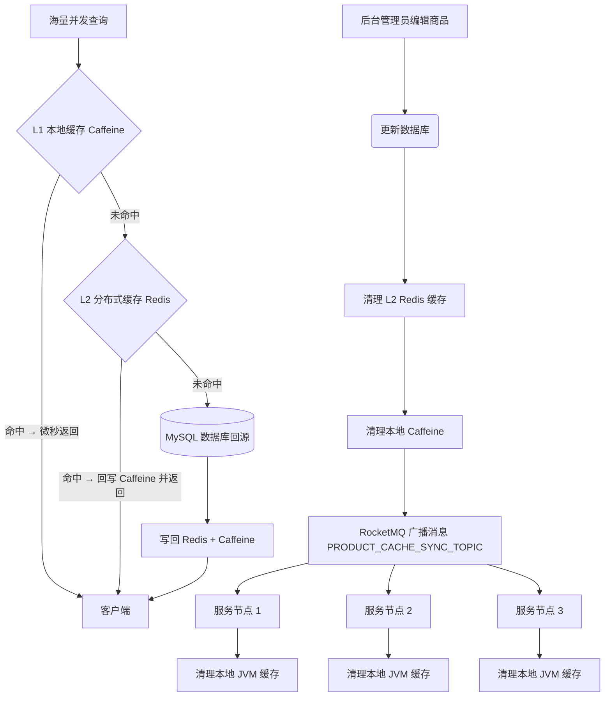

# 宁享购 (Ningxiang Go) 企业级微服务电商系统

  
  
  
  

  <a href="README.md">🇨🇳 中文</a> &nbsp;|&nbsp; <a href="README_EN.md">🇺🇸 English</a>

---

    <strong>企业级微服务电商系统 · Java 21 + Spring Boot 3 + Spring Cloud Alibaba + Vue 3 · 面向百万 QPS 高并发生产场景</strong>

## 📑 目录

- [项目简介](#-项目简介)
- [微服务核心架构设计与工程实践](#-微服务核心架构设计与工程实践-architecture--design)
- [后端微服务模块构成](#-后端微服务模块构成-comningxiangshop)
- [核心技术选型](#-核心技术选型)
- [编译与打包验证](#-编译与打包验证compilation-and-packaging-verification)
- [快速启动指南](#-快速启动指南)
- [参与贡献](#-参与贡献)
- [安全说明](#-安全说明)
- [许可证](#-许可证license)

---

## 🧾 项目简介

**宁享购 (Ningxiang Go)** 是一套基于 **Java 21 (LTS)**、**Spring Boot 3.3**、**Spring Cloud Alibaba 2023**、**Vue 3** 打造的、面向百万 QPS 高并发业务场景的生产级分布式微服务电商系统。

完整沉淀了 API 网关安全卸载、注解驱动多级缓存一致性、看门狗自动续期防超卖分布式锁、SpEL 切面幂等防重、Sentinel 熔断降级等一系列电商生产级后端最佳实践，并全量通过编译打包验证（`BUILD SUCCESS`），开箱 100% 可容器化部署。

---

## 🏗️ 微服务核心架构设计与工程实践 (Architecture & Design)

本节依次展开 7 大核心工程能力的选型、取舍与落地实现，所有源码均提供直达链接可审阅：

### 1. 网关安全卸载 & 零 RPC 认证 🛡️

*   **架构演进**：传统每个微服务都发起 Feign 远程调用到认证中心校验 Token，链路开销巨大。宁享购将认证过滤器统一前置到 API 网关（Reactive Reactor 过滤器），网关在 Token 校验后把 Redis 中缓存的 Sa-Session 用户数据 JSON 序列化并 URL 编码后通过 `x-user-info` 请求头透传给下游，业务微服务仅做一次 Header 解码即完成登录态注入，**内部鉴权 RPC 开销降为 0**。
*   **时序流程**：

*   **📂 源码直达**：
    - [SaTokenConfig.java (网关路由安全过滤器)](ningxiang-gateway/src/main/java/com/ningxiang/shop/gateway/config/SaTokenConfig.java)
    - [GlobalAuthFilter.java (网关用户信息序列化透传过滤器)](ningxiang-gateway/src/main/java/com/ningxiang/shop/gateway/filter/GlobalAuthFilter.java)
    - [AuthFilter.java (业务侧轻量 Header 解码过滤器)](ningxiang-common/ningxiang-common-security/src/main/java/com/ningxiang/shop/common/security/filter/AuthFilter.java)
    - [TokenStore.java (认证中心无状态 JWT 令牌管理器)](ningxiang-auth/src/main/java/com/ningxiang/shop/auth/manager/TokenStore.java)

---

### 2. 注解驱动多级缓存 + 一致性同步 🚀

*   **架构演进**：高并发商品查询场景 Redis 网络 I/O 是瓶颈。宁享购自研 **Spring Cache 规范**兼容的 `MultilevelCacheManager`：本地 JVM Caffeine 作为 L1 缓存（微秒级命中），远端 Redis 作为 L2 缓存。查询优先命中 Caffeine，未命中再回源 Redis；当商品变更触发缓存清理时，先清理 Redis，再通过 RocketMQ 广播一条失效通知，**所有微服务实例监听并清理本地 Caffeine**，以最小化一致性同步开销。
*   **一致性同步流程图**：

*   **📂 源码直达**：
    - [MultilevelCache.java (二级缓存容器实现)](ningxiang-product/src/main/java/com/ningxiang/shop/product/config/MultilevelCache.java)
    - [MultilevelCacheManager.java (注解驱动缓存管理器)](ningxiang-product/src/main/java/com/ningxiang/shop/product/config/MultilevelCacheManager.java)
    - [MultilevelCacheConfig.java (Spring 自动装配配置)](ningxiang-product/src/main/java/com/ningxiang/shop/product/config/MultilevelCacheConfig.java)
    - [ProductCacheSyncListener.java (RocketMQ 广播缓存失效监听器)](ningxiang-product/src/main/java/com/ningxiang/shop/product/listener/ProductCacheSyncListener.java)
