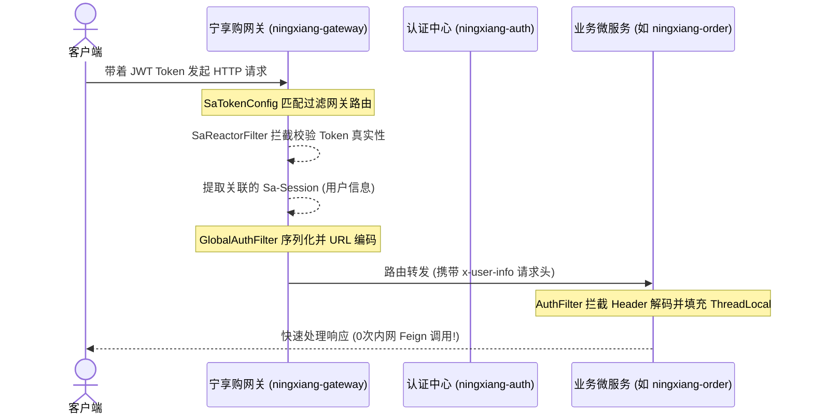
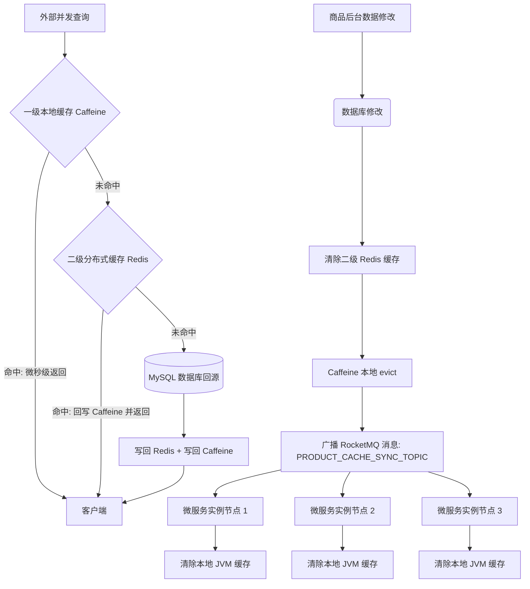

# 宁享购 (Ningxiang Go) 企业级微服务电商系统

[🇨🇳 中文](#-中文) | [🇺🇸 English Summary](#-english-summary)

---

## 🇨🇳 中文

宁享购（Ningxiang Go）是一套基于 **Java 21**、**Spring Boot 3.3** 以及 **Vue 3** 体系构建的分布式微服务电商系统。项目聚焦于百万级高并发场景下的架构演进与优化，沉淀了核心鉴权下沉、多级缓存一致性保障、高并发防超卖分布式锁、通用幂等拦截框架以及 Sentinel 流量防护等生产级后端最佳实践，已通过全局编译打包测试（BUILD SUCCESS），具备 100% 容器化就绪生产力。

---

## 🛠️ 微服务核心架构设计与工程实践 (Architecture & Design)

本文主要分享“宁享购”微服务商城的底层核心技术选型、高并发场景下的痛点思考及对应的工程解决方案。以下架构模块均在本项目中进行了完整的实现与落地，点击对应模块中的源码直链，即可查阅底层的核心代码实现细节：

### 1. 统一网关鉴权下沉与零 RPC 鉴权设计 (Gateway Security) 🛡️

*   **架构演进与思考**：将原本“业务微服务每次请求都需通过 Feign 远程调用认证中心校验 Token”的旧有模式进行重构。全部鉴权拦截统一置于网关层（响应式 Reactor 过滤器），网关校验通过后提取 Sa-Session 缓存在 Redis 中的用户数据，JSON 序列化并进行 URL 编码后，放入 `x-user-info` 请求头传递给下游。业务微服务仅需从请求头中解码即可，**内网鉴权 RPC 交互开销降为 0**。
*   **时序原理图**：

*   **📂 核心源码直链**：
    - [SaTokenConfig.java (网关路由前置鉴权)](ningxiang-gateway/src/main/java/com/ningxiang/shop/gateway/config/SaTokenConfig.java)
    - [GlobalAuthFilter.java (网关用户信息序列化及向下透传过滤器)](ningxiang-gateway/src/main/java/com/ningxiang/shop/gateway/filter/GlobalAuthFilter.java)
    - [AuthFilter.java (业务微服务侧轻量级免 Feign 身份解码过滤器)](ningxiang-common/ningxiang-common-security/src/main/java/com/ningxiang/shop/common/security/filter/AuthFilter.java)
    - [TokenStore.java (认证中心 Sa-Token JWT 无状态登录颁发管理器)](ningxiang-auth/src/main/java/com/ningxiang/shop/auth/manager/TokenStore.java)

---

### 2. 注解驱动的多级缓存架构与一致性同步方案 (Multi-Level Caching) 🚀

*   **架构演进与思考**：大促高并发下，频繁 of Redis 网络 I/O 是核心响应慢的瓶颈。本项目自定义了符合 Spring 缓存抽象的 `MultilevelCacheManager`。本地 JVM 缓存 Caffeine 充当一级缓存，远程 Redis 充当二级缓存。读取时优先击中 Caffeine（微秒级响应），未命中再读取 Redis 并回写本地。当后台修改商品或执行缓存失效时，除了清理 Redis，还会向 RocketMQ 广播清除通知，集群中所有部署的微服务实例监听到广播后，自动擦除本地 Caffeine，**一致性同步开销降至最低**。
*   **缓存同步链路图**：

*   **📂 核心源码直链**：
    - [MultilevelCache.java (自定义双级缓存容器实现)](ningxiang-product/src/main/java/com/ningxiang/shop/product/config/MultilevelCache.java)
    - [MultilevelCacheManager.java (注解级多级缓存管理器)](ningxiang-product/src/main/java/com/ningxiang/shop/product/config/MultilevelCacheManager.java)
    - [MultilevelCacheConfig.java (多级缓存 Spring 自动化装配)](ningxiang-product/src/main/java/com/ningxiang/shop/product/config/MultilevelCacheConfig.java)
    - [ProductCacheSyncListener.java (基于 RocketMQ 广播模式的本地缓存集群同步清理监听器)](ningxiang-product/src/main/java/com/ningxiang/shop/product/listener/ProductCacheSyncListener.java)

---

### 3. Java 21 虚拟线程全局落地与 I/O 吞吐演进 (Virtual Threads) ⚡

*   **架构演进与思考**：在高 I/O 阻塞的微服务通信和交易场景下，Tomcat 容器和 TaskExecutor 底层的传统重量级物理线程池在高并发请求下会导致严重的内核线程上下文切换开销。项目基于 JDK 21 LTS 运行，开启了虚拟线程支持。Tomcat 会自动使用虚拟线程（每个仅占几百字节）处理请求，极大地提升了系统的并发处理能力和网络吞吐率，有效平滑了 JVM 线程的内存抖动。
*   **📂 核心配置直链**：
    - [bootstrap.yml (网关本地虚拟线程开启配置)](ningxiang-gateway/src/main/resources/bootstrap.yml#L3-L6) (配置有 `spring.threads.virtual.enabled: true`)
    - 其余 11 个业务微服务的 `bootstrap.yml` 中均已在 `spring:` 节点下全局注入并激活了此项高并发加速配置。

---

### 4. 动态多数据源读写分离与分布式事务一致性 (Database Router & Seata) 🗄️

*   **架构演进与思考**：
    - **读写分离**：数据库模块集成了动态数据源组件，微服务在代码层面可以通过 `@DS("master")` 与 `@DS("slave")` 切换不同的数据源，从而支持在代码或代理层将耗时的 Select 查询导流到只读从库，实现物理读写分离。
    - **分布式事务**：在跨模块交易中（如创建订单扣减库存），通过 Seata 全局事务管理器保持强一致性，通过 Feign 拦截器在 RPC 调用中透传 XID，确保即使在网络分区或异常发生时，分布式数据库状态也能实现最终一致性。
*   **📂 核心源码直链**：
    - [SeataRequestInterceptor.java (Seata 事务 ID 微服务间 Feign 传输拦截器)](ningxiang-common/ningxiang-common-database/src/main/java/com/ningxiang/shop/common/database/config/SeataRequestInterceptor.java)
    - [pom.xml (多数据源及分页依赖装配)](ningxiang-common/ningxiang-common-database/pom.xml#L35-L42)

---

### 5. 多 SKU 并发库存加锁防死锁优化与租约续期 (Distributed Locking & Watchdog) 🔒

*   **设计背景与痛点**：高并发大促场景下，多 SKU 订单的锁定由于不同线程加锁顺序不一致（如订单 A 锁 sku1, sku2；订单 B 并发锁 sku2, sku1），极易诱发**分布式死锁**。
*   **工程解决方案**：
    - **物理加锁顺序规整**：在执行锁定前，对传入的 SKU ID 列表进行**升序排序**，确保所有并发线程加锁的物理顺序完全一致，打破死锁的“循环等待”判定条件。
    - **Watchdog 租约自动续期**：使用 Redisson 锁（不设定具体的锁过期时间，由看门狗机制接管），每 10 秒对锁的有效时间自动续期。这规避了因网络延迟、长事务或 JVM 垃圾回收导致锁提前释放，进而发生商品超卖的并发隐患。
*   **📂 核心源码直链**：
    - [SkuStockLockServiceImpl.java (防死锁分布式锁核心实现)](ningxiang-product/src/main/java/com/ningxiang/shop/product/service/impl/SkuStockLockServiceImpl.java#L91-L177)

---

### 6. 通用 AOP 幂等防重组件（基于 SpEL 动态解析与 Redis 状态机） (Idempotency Framework) 🛡️

*   **设计背景与痛点**：微服务架构下，由于 RocketMQ 消息网络抖动重复投递、前端重复点击导致的数据脏污频发。传统的在业务层写 `select count(*)` 校验既不够优雅，又存在“读写时间差”导致的并发穿透风险。
*   **工程解决方案**：
    - **无侵入 AOP & SpEL 动态提取**：抽象出通用的 `@Idempotent` 幂等防重注解。切面内部基于 Spring EL（SpEL）解析器，动态获取方法入参中的业务主键（如订单ID、支付通知流水号）。
    - **Redis 三阶段状态控制**：利用 Redis `SETNX` 占位将对应的 Token 标记为 `PROCESSING` 状态，占位失败即代表重复提交并直接拦截；业务方法执行成功后置为 `SUCCESS` 并设置合理的 TTL（防止短时间内重复请求）；业务若执行失败或抛出异常，则主动删除对应 Key 释放重试。
*   **📂 核心源码直链**：
    - [Idempotent.java (防重幂等注解声明)](ningxiang-common/ningxiang-common-security/src/main/java/com/ningxiang/shop/common/security/annotation/Idempotent.java)
    - [IdempotentAspect.java (SpEL 解析与 Redis 状态管理切面)](ningxiang-common/ningxiang-common-security/src/main/java/com/ningxiang/shop/common/security/aspect/IdempotentAspect.java)
    - [OrderNotifyStockConsumer.java (消费端动态解析拦截实践)](ningxiang-product/src/main/java/com/ningxiang/shop/product/listener/OrderNotifyStockConsumer.java#L21-L28)

---

### 7. Sentinel 微服务核心链路流控与 Nacos 规则持久化 (High Availability & Fault Tolerance) 🚦

*   **设计背景与痛点**：库存锁定、订单结算等接口处于高载链路。若没有妥善的流量保护，一旦被上游流量突增冲垮，就会引发级联故障。而原生的 Sentinel 规则直接保存在内存中，服务重启即丢失。
*   **工程解决方案**：
    - **限流熔断埋点与 Fallback**：使用 `@SentinelResource` 保护库存锁定 API。在并发峰值超限时，通过 `BlockHandler` 直接返回排队重试响应，并在 `Fallback` 中拦截并规避系统底层报错的外泄。
    - **Nacos 规则源动态拉取与持久化**：在本地 `bootstrap.yml` 中配置 Sentinel 的 Nacos 数据源，将其与配置中心 Nacos 规则双向桥接。流控与熔断降级规则由 Nacos 统一存储和下发，彻底解决了生产环境下规则重启丢失的痛点。
*   **📂 核心源码直链**：
    - [SkuStockLockServiceImpl.java (流量防护与 Fallback 降级实现)](ningxiang-product/src/main/java/com/ningxiang/shop/product/service/impl/SkuStockLockServiceImpl.java#L90-L190)
    - [bootstrap.yml (Sentinel 控制台与 Nacos 数据源桥接)](ningxiang-product/src/main/resources/bootstrap.yml#L23-L35)

---

## 🛠️ 后端微服务模块构成 (com.ningxiang.shop)

```
ningxiang
├─ningxiang-api -- 微服务间内网 RPC 声明接口 (auth, product, order, user等)
├─ningxiang-auth -- 统一授权登录校验服务
├─ningxiang-biz -- 通用业务支撑服务（图片存储、短信网关等）
├─ningxiang-gateway -- 微服务统一网关（Sa-Token 响应式网关鉴权）
├─ningxiang-leaf -- 基于美团 Leaf 算法的分布式主键生成器
├─ningxiang-multishop -- 商家端业务微服务
├─ningxiang-platform -- 运营管理端业务微服务
├─ningxiang-product -- 商品与多级缓存服务
├─ningxiang-order -- 订单与交易流程服务
├─ningxiang-payment -- 聚合支付服务
├─ningxiang-rbac -- 角色及菜单权限控制服务
├─ningxiang-search -- 基于 ElasticSearch + Canal 的搜索引擎服务
├─ningxiang-user -- 用户资产与会员服务
└─ningxiang-common -- 核心公共依赖与架构抽象组件
```

---

## 📊 核心技术选型

*   **开发语言**：Java 21 (LTS)
*   **微服务基座**：Spring Boot 3.3.0 + Spring Cloud 2023.0.1 + Spring Cloud Alibaba 2023.0.1.0
*   **注册/配置中心**：Nacos 2.3.2
*   **安全与鉴权**：Sa-Token 1.38.0 + sa-token-jwt (无状态 JWT 模式)
*   **分布式事务**：Seata 2.0.0 (AT/TCC 模式)
*   **消息队列**：RocketMQ 5.x
*   **一级缓存**：Caffeine 3.x
*   **二级缓存**：Redis 7.x + Jackson 序列化
*   **多数据源组件**：dynamic-datasource 4.3.0 (MySQL 读写分离配置支持)
*   **数据库**：MySQL 8.0 + MyBatis / MyBatis-Plus
*   **前端框架**：Vue 3 + Vite 5 + TS + Element Plus

---

## 📦 编译与打包验证 (Compilation and Packaging Verification)

项目全局已通过 `mvn clean package -DskipTests` 的测试打包，各微服务模块均能完美编译打包出可执行二进制包，控制台真实构建输出如下：

```bash
[INFO] Reactor Summary for ningxiang 1.0-SNAPSHOT:
[INFO] 
[INFO] ningxiang .......................................... SUCCESS [  0.253 s]
[INFO] ningxiang-gateway .................................. SUCCESS [ 17.805 s]
[INFO] ningxiang-common ................................... SUCCESS [  0.005 s]
[INFO] ningxiang-common-core .............................. SUCCESS [  5.694 s]
...
[INFO] ningxiang-product .................................. SUCCESS [  6.759 s]
[INFO] ningxiang-search ................................... SUCCESS [  7.248 s]
[INFO] ningxiang-user ..................................... SUCCESS [  4.315 s]
[INFO] ningxiang-order .................................... SUCCESS [  5.635 s]
[INFO] ningxiang-payment .................................. SUCCESS [  4.988 s]
[INFO] ------------------------------------------------------------------------
[INFO] BUILD SUCCESS
[INFO] ------------------------------------------------------------------------
[INFO] Total time:  01:58 min
```

---

## 🏃 开发环境快速启动指南

### 1. 启动中间件
推荐使用本地 Docker 容器快速拉起开发所需的各项中间件：
*   **MySQL 8.0**
*   **Redis 7.x**
*   **RocketMQ 5.x**
*   **Nacos 2.x**
*   **Seata 2.0.0**

### 2. 数据库与配置导入
1.  创建 MySQL 数据库，将 [db/](db/) 目录下各模块对应的 SQL 脚本导入。
2.  登录 Nacos 控制台（`http://localhost:8848/nacos`），将 [db/ningxiang_nacos.sql](db/ningxiang_nacos.sql) 中的配置表导入配置中心。
3.  在 Nacos 的 `application-dev.yml` 配置中修改 MySQL 数据库连接、Redis 与 RocketMQ 地址。

### 3. 微服务启动
在 IDE 中执行以下各模块的主启动类（`Application`）：
1.  `ningxiang-leaf` (ID 生成服务)
2.  `ningxiang-auth` (认证中心)
3.  `ningxiang-gateway` (统一网关，服务端口：`8000`)
4.  其他业务微服务（`ningxiang-product`、`ningxiang-user`、`ningxiang-order` 等）

---

## 🇺🇸 English Summary

**Ningxiang Go (宁享购)** is an enterprise-grade distributed microservices e-commerce system built on **Java 21 (LTS)**, **Spring Boot 3.3**, and **Spring Cloud Alibaba**. 

### Core Architectural Highlights
- **Gateway Security Offloading**: Sa-Token reactive gateway filters offload JWT validation, reducing internal RPC authentication overhead to zero.
- **Annotation-Driven Multi-Level Caching**: Caffeine JVM L1 cache + Redis L2 cache with RocketMQ broadcast eviction sync.
- **Java 21 Virtual Threads**: Global enablement across Tomcat & thread pools for high I/O concurrency.
- **Distributed Locking & Watchdog**: Ordered SKU locks preventing distributed deadlocks, backed by Redisson watchdog lease auto-renewal.
- **AOP Idempotency Framework**: SpEL dynamic parsing with Redis 3-phase state control (`PROCESSING` -> `SUCCESS`).
- **Sentinel High Availability**: Protection with Nacos rules persistence and fallback handling.
