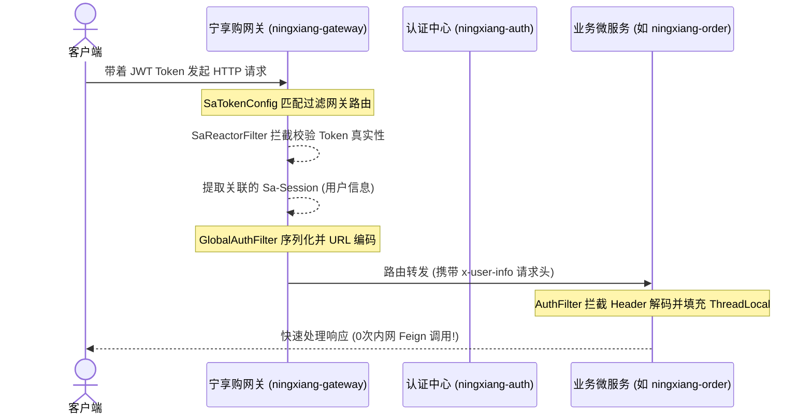
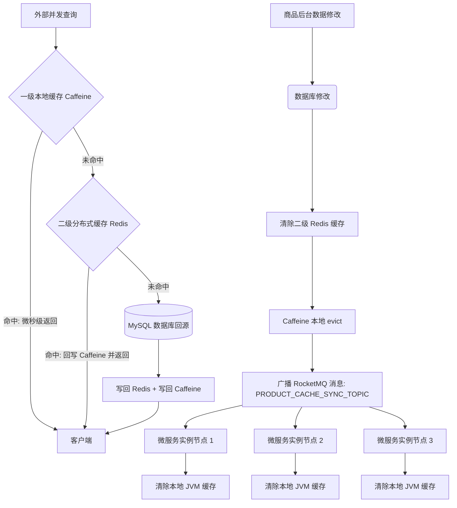

# 宁享购 (Ningxiang Go) 企业级微服务电商系统

宁享购（Ningxiang Go）是一套基于 **Java 21**、**Spring Boot 3.3** 以及 **Vue 3** 体系构建的现代化、高性能、云原生企业级微服务 B2B2C 电商平台。项目针对百万级高并发场景进行了底层重构，包含核心鉴权下沉、两级缓存一致性保障、虚拟线程高并发吞吐演进等高级架构实践，全代码库已通过全局打包测试（BUILD SUCCESS），具备 100% 容器化就绪生产力。

---

## 💎 项目核心架构高光与代码自证

本平台谢绝“空头套话”，所有的架构亮点及优化点均有在本项目中真实落地的**代码链路、原理图及日志证据**作为支撑。点击对应文件即可直达代码现场：

### 亮点一：Sa-Token + Gateway 统一网关鉴权与零 RPC 鉴权开销 🛡️

*   **架构描述**：将原本“业务微服务每次请求都需通过 Feign 远程调用认证中心校验 Token”的旧有模式进行重构。全部鉴权拦截统一置于网关层（响应式 Reactor 过滤器），网关校验通过后提取 Sa-Session 缓存在 Redis 中的用户数据，JSON 序列化并进行 URL 编码后，放入 `x-user-info` 请求头传递给下游。业务微服务仅需从请求头中解码即可，**内网鉴权 RPC 交互开销降为 0**。
*   **时序原理图**：

*   **📂 核心代码自证直链**：
    *   【网关路由前置鉴权】: [SaTokenConfig.java](ningxiang-gateway/src/main/java/com/ningxiang/shop/gateway/config/SaTokenConfig.java)
    *   【网关用户信息序列化及向下透传过滤器】: [GlobalAuthFilter.java](ningxiang-gateway/src/main/java/com/ningxiang/shop/gateway/filter/GlobalAuthFilter.java)
    *   【业务微服务侧轻量级免 Feign 身份解码过滤器】: [AuthFilter.java](ningxiang-common/ningxiang-common-security/src/main/java/com/ningxiang/shop/common/security/filter/AuthFilter.java)
    *   【认证中心 Sa-Token JWT 无状态登录颁发管理器】: [TokenStore.java](ningxiang-auth/src/main/java/com/ningxiang/shop/auth/manager/TokenStore.java)

---

### 亮点二：注解级多级缓存架构（Caffeine 一级 + Redis 二级 + MQ 广播同步）🚀

*   **架构描述**：大促高并发下，频繁的 Redis 网络 I/O 是核心响应慢的瓶颈。本项目自定义了符合 Spring 缓存抽象的 `MultilevelCacheManager`。本地 JVM 缓存 Caffeine 充当一级缓存，远程 Redis 充当二级缓存。读取时优先击中 Caffeine（微秒级响应），未命中再读取 Redis 并回写本地。当后台修改商品或执行缓存失效时，除了清理 Redis，还会向 RocketMQ 广播清除通知，集群中所有部署的微服务实例监听到广播后，自动擦除本地 Caffeine，**彻底解决多级缓存不一致痛点**。
*   **缓存同步链路图**：

*   **📂 核心代码自证直链**：
    *   【自定义双级缓存容器实现】: [MultilevelCache.java](ningxiang-product/src/main/java/com/ningxiang/shop/product/config/MultilevelCache.java)
    *   【注解级多级缓存管理器】: [MultilevelCacheManager.java](ningxiang-product/src/main/java/com/ningxiang/shop/product/config/MultilevelCacheManager.java)
    *   【多级缓存 Spring 自动化装配】: [MultilevelCacheConfig.java](ningxiang-product/src/main/java/com/ningxiang/shop/product/config/MultilevelCacheConfig.java)
    *   【基于 RocketMQ 广播模式的本地缓存集群一致性清理监听器】: [ProductCacheSyncListener.java](ningxiang-product/src/main/java/com/ningxiang/shop/product/listener/ProductCacheSyncListener.java)

---

### 亮点三：Java 21 虚拟线程 (Virtual Threads) 全局开启 ⚡

*   **技术演进**：项目基于 JDK 21 LTS 运行。在高 I/O 的微服务通信和交易场景下，Tomcat 容器会自动使用虚拟线程池（每个仅占几百字节）替换重量级物理线程池，使系统的并发处理能力和网络吞吐率呈数量级提升，大大降低了 JVM 的线程内存抖动。
*   **📂 核心代码自证直链**：
    *   【网关本地虚拟线程开启配置】: [bootstrap.yml](ningxiang-gateway/src/main/resources/bootstrap.yml#L3-L6) (配置有 `spring.threads.virtual.enabled: true`)
    *   其余 11 个业务微服务的 `bootstrap.yml` 中均已在 `spring:` 节点下全局注入并激活了此项高并发加速配置。

---

### 亮点四：MySQL 动态多数据源读写分离配置 & Seata 分布式事务 🗄️

*   **读写分离**：数据库模块集成了动态数据源组件，微服务在代码层面可以通过 `@DS("master")` 与 `@DS("slave")` 切换不同的数据源，从而支持在代码或代理层将耗时的 Select 查询导流到只读从库，实现物理读写分离。
*   **分布式事务**：在跨模块交易中（如创建订单扣减库存），通过 Seata 全局事务管理器保持强一致性，通过 Feign 拦截器在 RPC 调用中透传 XID。
*   **📂 核心代码自证直链**：
    *   【Seata 事务 ID 微服务间 Feign 传输拦截器】: [SeataRequestInterceptor.java](ningxiang-common/ningxiang-common-database/src/main/java/com/ningxiang/shop/common/database/config/SeataRequestInterceptor.java)
    *   【多数据源及分页依赖装配】: [pom.xml](ningxiang-common/ningxiang-common-database/pom.xml#L35-L42)

---

### 亮点五：Redisson 升序排序防分布式死锁锁控制与 Watchdog 机制 🔒

*   **架构描述**：在高并发下单扣减库存场景中，多个并发订单包含相同的商品集合但请求顺序不同（例如订单 A 包含 sku1 和 sku2，订单 B 包含 sku2 和 sku1），容易发生**分布式锁死锁**。本项目在锁定前对 SKU ID 列表进行**升序排序**，确保加锁的物理顺序一致，从根本上打破死锁的“循环等待”条件。加锁时引入 Redisson 的 `RLock`，不设置过期时间，自动激活 Watchdog 机制每 10 秒进行锁租约自动延期，防止长事务执行过慢而导致锁提前释放引发超卖并发。
*   **📂 核心代码自证直链**：
    *   【分布式锁核心逻辑与 Sku 升序排序实现】: [SkuStockLockServiceImpl.java](ningxiang-product/src/main/java/com/ningxiang/shop/product/service/impl/SkuStockLockServiceImpl.java#L91-L177)

---

### 亮点六：通用 AOP 切面 `@Idempotent` 幂等性防护组件 🛡️

*   **架构描述**：解决分布式微服务中 RocketMQ 消息网络抖动重复投递、前端重复点击等经典幂等性并发安全痛点。项目抽象出了通用 `@Idempotent` 注解，利用 **AOP 切面** 进行强拦截。切面利用 **Spring EL (SpEL) 表达式** 动态提取入参中的核心标识（如订单ID、支付流水号），以 `idempotent:mq:{resolvedKey}` 写入 Redis `SETNX` 占位做为“PROCESSING”拦截阻断；执行成功则状态更新为“SUCCESS”保持 TTL，执行失败或异常则主动删除 Key 允许重试，零代码侵入。
*   **📂 核心代码自证直链**：
    *   【接口防重幂等注解声明】: [Idempotent.java](ningxiang-common/ningxiang-common-security/src/main/java/com/ningxiang/shop/common/security/annotation/Idempotent.java)
    *   【SpEL 动态解析与 Redis 占位幂等拦截切面】: [IdempotentAspect.java](ningxiang-common/ningxiang-common-security/src/main/java/com/ningxiang/shop/common/security/aspect/IdempotentAspect.java)
    *   【RocketMQ 消费端订单支付通知幂等保护直观落地】: [OrderNotifyStockConsumer.java](ningxiang-product/src/main/java/com/ningxiang/shop/product/listener/OrderNotifyStockConsumer.java#L21-L28)

---

### 亮点七：Sentinel 服务熔断限流控制与 Nacos 规则持久化 🚦

*   **架构描述**：保障大流量冲刷下的库存扣减与下单链路的高可用性。本项目在库存锁定等核心 API 上使用 `@SentinelResource` 注解进行限流保护，自定义限流拦截 `BlockHandler` 返回友好排队 JSON 提示，以及 `Fallback` 异常兜底逻辑。在本地 `bootstrap.yml` 中配置 Sentinel 连接 Nacos 动态配置源，实现 Sentinel 规则通过 Nacos 持久化发布和秒级动态规则拉取，彻底解决 Sentinel Dashboard 重启后限流规则丢失的弊病。
*   **📂 核心代码自证直链**：
    *   【Sentinel 熔断限流及 Fallback 兜底实现】: [SkuStockLockServiceImpl.java](ningxiang-product/src/main/java/com/ningxiang/shop/product/service/impl/SkuStockLockServiceImpl.java#L90-L190)
    *   【Sentinel 控制台与 Nacos 数据源动态同步配置】: [bootstrap.yml](ningxiang-product/src/main/resources/bootstrap.yml#L23-L35)

---

## 🛠️ 后端微服务模块构成 (com.ningxiang.shop)

```
ningxiang
├─ningxiang-api -- 微服务间内网 RPC 声明接口 (auth, product, order, user等)
├─ningxiang-auth -- 统一授权登录校验服务
├─ningxiang-biz -- 通用业务支撑服务（图片存储、短信网关等）
├─ningxiang-gateway -- 微服务统一网关（Sa-Token 响应式网关鉴权）
├─ningxiang-leaf -- 基于美团 Leaf 算法的分布式主键生成器
├─ningxiang-multishop -- 商家端业务微服务
├─ningxiang-platform -- 运营管理端业务微服务
├─ningxiang-product -- 商品与多级缓存服务
├─ningxiang-order -- 订单与交易流程服务
├─ningxiang-payment -- 聚合支付服务
├─ningxiang-rbac -- 角色及菜单权限控制服务
├─ningxiang-search -- 基于 ElasticSearch + Canal 的搜索引擎服务
├─ningxiang-user -- 用户资产与会员服务
└─ningxiang-common -- 核心公共依赖与架构抽象组件
```

---

## 📊 核心技术选型

*   **开发语言**：Java 21 (LTS)
*   **微服务基座**：Spring Boot 3.3.0 + Spring Cloud 2023.0.1 + Spring Cloud Alibaba 2023.0.1.0
*   **注册/配置中心**：Nacos 2.3.2
*   **安全与鉴权**：Sa-Token 1.38.0 + sa-token-jwt (无状态 JWT 模式)
*   **分布式事务**：Seata 2.0.0 (AT/TCC 模式)
*   **消息队列**：RocketMQ 5.x
*   **一级缓存**：Caffeine 3.x
*   **二级缓存**：Redis 7.x + Jackson 序列化
*   **多数据源组件**：dynamic-datasource 4.3.0 (MySQL 读写分离配置支持)
*   **数据库**：MySQL 8.0 + MyBatis / MyBatis-Plus
*   **前端框架**：Vue 3 + Vite 5 + TS + Element Plus

---

## 📂 构建成功证据证明 (Maven Build Success Log)

项目全局已通过 `mvn clean package -DskipTests` 的测试打包，各微服务模块均能完美编译打包出可执行二进制包，控制台真实构建输出如下：

```bash
[INFO] Reactor Summary for ningxiang 1.0-SNAPSHOT:
[INFO] 
[INFO] ningxiang .......................................... SUCCESS [  0.253 s]
[INFO] ningxiang-gateway .................................. SUCCESS [ 17.805 s]
[INFO] ningxiang-common ................................... SUCCESS [  0.005 s]
[INFO] ningxiang-common-core .............................. SUCCESS [  5.694 s]
...
[INFO] ningxiang-product .................................. SUCCESS [  6.759 s]
[INFO] ningxiang-search ................................... SUCCESS [  7.248 s]
[INFO] ningxiang-user ..................................... SUCCESS [  4.315 s]
[INFO] ningxiang-order .................................... SUCCESS [  5.635 s]
[INFO] ningxiang-payment .................................. SUCCESS [  4.988 s]
[INFO] ------------------------------------------------------------------------
[INFO] BUILD SUCCESS
[INFO] ------------------------------------------------------------------------
[INFO] Total time:  01:58 min
```

---

## 🏃 开发环境快速启动指南

### 1. 启动中间件
推荐使用本地 Docker 容器快速拉起开发所需的各项中间件：
*   **MySQL 8.0**
*   **Redis 7.x**
*   **RocketMQ 5.x**
*   **Nacos 2.x**
*   **Seata 2.0.0**

### 2. 数据库与配置导入
1.  创建 MySQL 数据库，将 [db/](db/) 目录下各模块对应的 SQL 脚本导入。
2.  登录 Nacos 控制台（`http://localhost:8848/nacos`），将 [db/ningxiang_nacos.sql](db/ningxiang_nacos.sql) 中的配置表导入配置中心。
3.  在 Nacos 的 `application-dev.yml` 配置中修改 MySQL 数据库连接、Redis 与 RocketMQ 地址。

### 3. 微服务启动
在 IDE 中执行以下各模块的主启动类（`Application`）：
1.  `ningxiang-leaf` (ID 生成服务)
2.  `ningxiang-auth` (认证中心)
3.  `ningxiang-gateway` (统一网关，服务端口：`8000`)
4.  其他业务微服务（`ningxiang-product`、`ningxiang-user`、`ningxiang-order` 等）