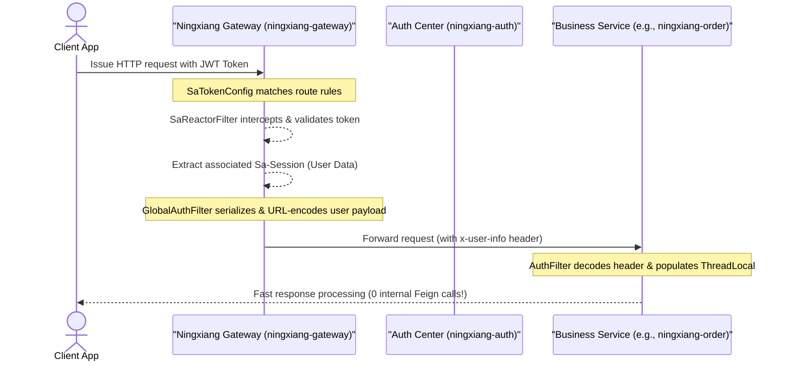

# Ningxiang Go (宁享购) Enterprise Microservices E-Commerce System

  
  
  
  

  <a href="README.md">🇨🇳 中文</a> &nbsp;|&nbsp; <a href="README_EN.md">🇺🇸 English</a>

---

    <strong>Enterprise Microservices E-Commerce · Java 21 + Spring Boot 3 + Spring Cloud Alibaba + Vue 3 · Production-Grade for 1M+ QPS</strong>

## 📑 Table of Contents

- [📖 Introduction](#-introduction)
- [🛠️ Microservice Core Architecture & Engineering Design](#️-microservice-core-architecture--engineering-design)
- [🛠️ Microservice Module Breakdown](#️-microservice-module-breakdown-comningxiangshop)
- [📊 Core Technology Stack Matrix](#-core-technology-stack-matrix)
- [📦 Compilation & Packaging Verification](#-compilation--packaging-verification)
- [🏃 Quick Start Guide](#-quick-start-guide)
- [🤝 Contributing](#-contributing)
- [🔒 Security](#-security)
- [📜 License](#-license)

---

## 📖 Introduction

**Ningxiang Go (宁享购)** is a production-grade distributed microservices e-commerce system built on **Java 21 (LTS)**, **Spring Boot 3.3**, **Spring Cloud Alibaba 2023**, and **Vue 3**.

Engineered specifically for high-concurrency environments handling 1,000,000+ QPS stress scenarios, the system encapsulates production-level backend best practices: API gateway security offloading, annotation-driven multi-level caching consistency, anti-overselling distributed locking with watchdog auto-renewal, custom SpEL-based AOP idempotency protection, and Sentinel fault-tolerance. Global compilation and packaging verification (`BUILD SUCCESS`) are fully passed, providing 100% containerization-ready deployment productivity.

---

## 🛠️ Microservice Core Architecture & Engineering Design

This section highlights the technical selection, architectural trade-offs, and engineering solutions implemented in Ningxiang Go. Click any source code link below to inspect exact implementation details:

### 1. Gateway Security Offloading & Zero-RPC Authentication 🛡️

*   **Architectural Evolution**: Refactored the traditional pattern where every microservice issues Feign RPC calls to the auth center for token validation. All authentication filters are unified at the API Gateway layer (Reactive Reactor filters). Upon token validation, the gateway extracts Sa-Session user data cached in Redis, serializes it into JSON, URL-encodes it, and passes it downstream via the `x-user-info` HTTP header. Business microservices simply decode this header, **reducing internal RPC authentication overhead to exactly zero**.
*   **Sequence Diagram**:

*   **📂 Direct Source Code Links**:
    - [SaTokenConfig.java (Gateway Route Security Filter)](ningxiang-gateway/src/main/java/com/ningxiang/shop/gateway/config/SaTokenConfig.java)
    - [GlobalAuthFilter.java (Gateway User Info Serialization Filter)](ningxiang-gateway/src/main/java/com/ningxiang/shop/gateway/filter/GlobalAuthFilter.java)
    - [AuthFilter.java (Lightweight Service Header Decoding Filter)](ningxiang-common/ningxiang-common-security/src/main/java/com/ningxiang/shop/common/security/filter/AuthFilter.java)
    - [TokenStore.java (Auth Center Stateless JWT Token Manager)](ningxiang-auth/src/main/java/com/ningxiang/shop/auth/manager/TokenStore.java)
