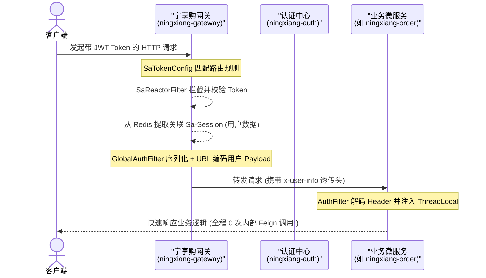
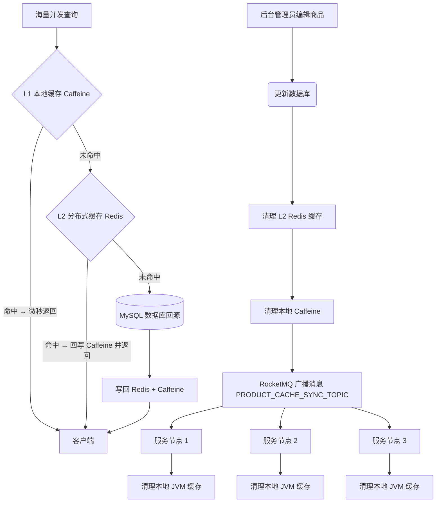

<!-- 
  Designed & Built with ❤️ by MeiSiristhebest (https://github.com/MeiSiristhebest)
  If this repository helps your learning or engineering, please consider dropping a ⭐ Star!
-->
# 宁享购 (Ningxiang Go) 企业级微服务电商系统

<p align="center">
  <b><a href="./README.md">English</a> | 简体中文</b>
</p>

> [!TIP]
> 💡 **如果本项目的架构设计、工程实践或开源基础设施对您有所启发，欢迎点亮右上角 ⭐ Star 支持创作者！**
> 📚 查阅核心架构设计文档：[ARCHITECTURE_zh.md](./ARCHITECTURE_zh.md)


<p align="center">
  <a href="LICENSE"></a>
  <a href="https://openjdk.org/projects/jdk/21/"></a>
  <a href="https://spring.io/projects/spring-boot"></a>
  <a href="https://spring.io/projects/spring-cloud"></a>
</p>

<p align="center">
  <a href="README.md">🇨🇳 中文</a> &nbsp;|&nbsp; <a href="README_EN.md">🇺🇸 English</a>
</p>


---

<p align="center">
  <strong>企业级微服务电商系统 · Java 21 + Spring Boot 3 + Spring Cloud Alibaba + Vue 3 · 面向百万 QPS 高并发生产场景</strong>
</p>

## 📑 目录

- [项目简介](#-项目简介)
- [核心功能](#-核心功能)
- [环境要求](#-环境要求)
- [安装与编译验证](#-安装与编译验证)
- [快速启动指南](#-快速启动指南)
- [配置说明](#-配置说明)
- [微服务核心架构设计与工程实践](#-微服务核心架构设计与工程实践)
- [后端微服务模块构成](#-后端微服务模块构成)
- [核心技术选型](#-核心技术选型)
- [参与贡献](#-参与贡献)
- [安全说明](#-安全说明)
- [许可证](#-许可证)

---

## 📖 项目简介

**宁享购 (Ningxiang Go)** 是一套基于 **Java 21 (LTS)**、**Spring Boot 3.3**、**Spring Cloud Alibaba 2023**、**Vue 3** 打造的、面向百万 QPS 高并发业务场景的生产级分布式微服务电商系统。

完整沉淀了 API 网关安全卸载、注解驱动多级缓存一致性、看门狗自动续期防超卖分布式锁、SpEL 切面幂等防重、Sentinel 熔断降级等一系列电商生产级后端最佳实践，并全量通过编译打包验证（`BUILD SUCCESS`），开箱 100% 可容器化部署。

---

## ✨ 核心功能

- **网关安全卸载 & 零 RPC 认证**：认证过滤器前置到 API 网关，经 `x-user-info` 透传登录态，内部鉴权 RPC 开销降为 0。
- **注解驱动多级缓存 + 一致性同步**：Caffeine（L1）+ Redis（L2）双层缓存，配合 RocketMQ 广播失效通知，保证集群缓存一致性。
- **Java 21 虚拟线程**：`spring.threads.virtual.enabled: true` 全局启用虚拟线程，显著提升 I/O 吞吐与 JVM 堆平滑度。
- **动态多数据源读写分离 + Seata 分布式事务**：`@DS` 注解路由读写库，Seata（AT/TCC）跨服务保证最终一致性。
- **多 SKU 分布式锁 & 死锁规避**：SKU ID 升序归一化加锁 + Redisson 看门狗自动续期，从机制上消除库存超卖。
- **通用 AOP 幂等框架**：`@Idempotent` 注解 + SpEL 解析 + Redis 三阶段状态机，防重复提交与 MQ 重试。
- **Sentinel 熔断限流 & Nacos 规则持久化**：`@SentinelResource` 防护核心接口，规则统一由 Nacos 下发、重启不丢失。

---

## 🔧 环境要求

| 依赖 | 版本 |
|------|------|
| JDK | 21 (LTS) |
| Maven | 3.9+ |
| Docker / Docker Compose | 最新稳定版 |
| MySQL | 8.0 |
| Redis | 7.x |
| RocketMQ | 5.x |
| Nacos | 2.3.2 |
| Seata | 2.0.0 |

---

## 📦 安装与编译验证

项目已通过 `mvn clean package -DskipTests` 全量编译，真实构建输出节选如下：

```bash
[INFO] Reactor Summary for ningxiang 1.0-SNAPSHOT:
[INFO]
[INFO] ningxiang .......................................... SUCCESS [  0.253 s]
[INFO] ningxiang-gateway .................................. SUCCESS [ 17.805 s]
[INFO] ningxiang-common ................................... SUCCESS [  0.005 s]
[INFO] ningxiang-common-core .............................. SUCCESS [  5.694 s]
...
[INFO] ningxiang-product .................................. SUCCESS [  6.759 s]
[INFO] ningxiang-search ................................... SUCCESS [  7.248 s]
[INFO] ningxiang-user ..................................... SUCCESS [  4.315 s]
[INFO] ningxiang-order .................................... SUCCESS [  5.635 s]
[INFO] ningxiang-payment .................................. SUCCESS [  4.988 s]
[INFO] ------------------------------------------------------------------------
[INFO] BUILD SUCCESS
[INFO] ------------------------------------------------------------------------
[INFO] Total time:  01:58 min
```

---

## 🏃 快速启动指南

### 1. 启动中间件

推荐使用本地 Docker 容器快速拉起开发所需的各项中间件：

- **MySQL 8.0**
- **Redis 7.x**
- **RocketMQ 5.x**
- **Nacos 2.x**
- **Seata 2.0.0**

### 2. 数据库与配置导入

1. 创建 MySQL 数据库，将 [db/](db/) 目录下各模块对应的 SQL 脚本导入。
2. 登录 Nacos 控制台（`http://localhost:8848/nacos`），将 [db/ningxiang_nacos.sql](db/ningxiang_nacos.sql) 中的配置表导入配置中心。
3. 在 Nacos 的 `application-dev.yml` 配置中修改 MySQL 数据库连接、Redis 与 RocketMQ 地址。

### 3. 微服务启动

在 IDE 中执行以下各模块的主启动类（`Application`）：

1. `ningxiang-leaf`（ID 生成服务）
2. `ningxiang-auth`（认证中心）
3. `ningxiang-gateway`（统一网关，服务端口：`8000`）
4. 其他业务微服务（`ningxiang-product`、`ningxiang-user`、`ningxiang-order` 等）

---

## ⚙️ 配置说明

系统的运行配置统一通过 **Nacos 配置中心** 管理：

- 将 [db/ningxiang_nacos.sql](db/ningxiang_nacos.sql) 中的配置表导入 Nacos 后，于 `application-dev.yml` 中维护 MySQL、Redis、RocketMQ 等连接信息。
- 全站通过 `bootstrap.yml` 全局启用 Java 21 虚拟线程：`spring.threads.virtual.enabled: true`。
- Sentinel 规则源接入 Nacos 数据源（`bootstrap.yml`），实现熔断限流规则动态下发与持久化。

```yaml
spring:
  threads:
    virtual:
      enabled: true
```

---

## 🏗️ 微服务核心架构设计与工程实践

本节依次展开 7 大核心工程能力的选型、取舍与落地实现，所有源码均提供直达链接可审阅：

### 1. 网关安全卸载 & 零 RPC 认证 🛡️

- **架构演进**：传统每个微服务都发起 Feign 远程调用到认证中心校验 Token，链路开销巨大。宁享购将认证过滤器统一前置到 API 网关（Reactive Reactor 过滤器），网关在 Token 校验后把 Redis 中缓存的 Sa-Session 用户数据 JSON 序列化并 URL 编码后通过 `x-user-info` 请求头透传给下游，业务微服务仅做一次 Header 解码即完成登录态注入，**内部鉴权 RPC 开销降为 0**。
- **时序流程**：



- **📂 源码直达**：
  - [SaTokenConfig.java (网关路由安全过滤器)](ningxiang-gateway/src/main/java/com/ningxiang/shop/gateway/config/SaTokenConfig.java)
  - [GlobalAuthFilter.java (网关用户信息序列化透传过滤器)](ningxiang-gateway/src/main/java/com/ningxiang/shop/gateway/filter/GlobalAuthFilter.java)
  - [AuthFilter.java (业务侧轻量 Header 解码过滤器)](ningxiang-common/ningxiang-common-security/src/main/java/com/ningxiang/shop/common/security/filter/AuthFilter.java)
  - [TokenStore.java (认证中心无状态 JWT 令牌管理器)](ningxiang-auth/src/main/java/com/ningxiang/shop/auth/manager/TokenStore.java)

---

### 2. 注解驱动多级缓存 + 一致性同步 🚀

- **架构演进**：高并发商品查询场景 Redis 网络 I/O 是瓶颈。宁享购自研 **Spring Cache 规范**兼容的 `MultilevelCacheManager`：本地 JVM Caffeine 作为 L1 缓存（微秒级命中），远端 Redis 作为 L2 缓存。查询优先命中 Caffeine，未命中再回源 Redis；当商品变更触发缓存清理时，先清理 Redis，再通过 RocketMQ 广播一条失效通知，**所有微服务实例监听并清理本地 Caffeine**，以最小化一致性同步开销。
- **一致性同步流程图**：



- **📂 源码直达**：
  - [MultilevelCache.java (二级缓存容器实现)](ningxiang-product/src/main/java/com/ningxiang/shop/product/config/MultilevelCache.java)
  - [MultilevelCacheManager.java (注解驱动缓存管理器)](ningxiang-product/src/main/java/com/ningxiang/shop/product/config/MultilevelCacheManager.java)
  - [MultilevelCacheConfig.java (Spring 自动装配配置)](ningxiang-product/src/main/java/com/ningxiang/shop/product/config/MultilevelCacheConfig.java)
  - [ProductCacheSyncListener.java (RocketMQ 广播缓存失效监听器)](ningxiang-product/src/main/java/com/ningxiang/shop/product/listener/ProductCacheSyncListener.java)

---

### 3. Java 21 虚拟线程 & 高 I/O 吞吐优化 ⚡

- **架构演进**：传统 Tomcat 容器的重 OS 内核线程池，在高 I/O 业务峰下内核态上下文切换开销巨大。宁享购全站运行在 JDK 21 LTS，`spring.threads.virtual.enabled: true` 全局启用虚拟线程，Tomcat 按请求自动分配重量仅数百字节的虚拟线程，**显著提升网络吞吐**与 JVM 堆平滑度。
- **📂 配置直达**：
  - [bootstrap.yml (网关虚拟线程配置)](ningxiang-gateway/src/main/resources/bootstrap.yml#L3-L6)
  - 全部 11 个业务微服务均在 `bootstrap.yml` 中全局启用虚拟线程。

---

### 4. 动态多数据源读写分离 + Seata 分布式事务 🗄️

- **架构演进**：
  - **读写分离**：各微服务通过 `@DS("master")` 与 `@DS("slave")` 注解动态路由数据源，把商品、订单、支付等高频查询负载压到只读从库，实现物理读写解耦。
  - **分布式事务**：跨模块事务（如下单同时扣库存）由 Seata 全局事务管理器（AT/TCC 模式）驱动，Feign 远程调用通过拦截器传播 XID，**跨网络分区保证最终一致性**。
- **📂 源码直达**：
  - [SeataRequestInterceptor.java (Seata XID Feign 透传拦截器)](ningxiang-common/ningxiang-common-database/src/main/java/com/ningxiang/shop/common/database/config/SeataRequestInterceptor.java)
  - [pom.xml (动态数据源依赖)](ningxiang-common/ningxiang-common-database/pom.xml#L35-L42)

---

### 5. 多 SKU 并发加锁 & 死锁规避 + 看门狗续期 🔒

- **痛点**：多 SKU 订单锁库存操作如果加锁顺序不一致（A 锁 SKU1 → SKU2；B 锁 SKU2 → SKU1），**极易触发分布式死锁**。
- **工程解**：
  - **物理锁序归一化**：加锁前对所有 SKU ID 做 **升序排序**，保证所有并发线程按完全一致的物理顺序拿锁，**破坏环路等待条件**。
  - **Redisson 看门狗自动续期**：基于 Redisson 实现分布式锁，启用 10 秒一次看门狗续期，**杜绝长事务/GC 卡顿造成的锁提前释放**，从机制上消除库存超卖。
- **📂 源码直达**：
  - [SkuStockLockServiceImpl.java (防死锁加锁实现)](ningxiang-product/src/main/java/com/ningxiang/shop/product/service/impl/SkuStockLockServiceImpl.java#L91-L177)

---

### 6. 通用 AOP 幂等框架（SpEL 解析 + Redis 状态机）🛡️

- **痛点**：RocketMQ 网络重试与前端重复点击造成数据重复；传统 `select count(*)` 先查后写存在读写间隙竞态。
- **工程解**：
  - **零侵入 AOP + SpEL 动态解析**：自定义 `@Idempotent` 注解，切面通过 Spring 表达式语言 (SpEL) 动态提取业务主键（订单号、支付流水号等）。
  - **Redis 三阶段状态控制**：Redis `SETNX` 抢占 `PROCESSING` 中状态，成功执行业务则写入 `SUCCESS` 状态并设置 TTL；异常则主动删除 Key 以释放合法重试机会。
- **📂 源码直达**：
  - [Idempotent.java (幂等注解声明)](ningxiang-common/ningxiang-common-security/src/main/java/com/ningxiang/shop/common/security/annotation/Idempotent.java)
  - [IdempotentAspect.java (SpEL + Redis 状态机切面)](ningxiang-common/ningxiang-common-security/src/main/java/com/ningxiang/shop/common/security/aspect/IdempotentAspect.java)
  - [OrderNotifyStockConsumer.java (MQ 消费端幂等拦截)](ningxiang-product/src/main/java/com/ningxiang/shop/product/listener/OrderNotifyStockConsumer.java#L21-L28)

---

### 7. Sentinel 熔断限流 + Nacos 规则持久化 🚦

- **痛点**：锁库存、支付结算等高负载接口需要熔断保护，Sentinel 默认内存规则重启即丢失。
- **工程解**：
  - **流量控制 + Fallback**：核心 API 通过 `@SentinelResource` 防护，突发峰值触发 `BlockHandler` 排队重试，运行时异常进入 `Fallback` 兜底。
  - **Nacos 规则源持久化**：通过 `bootstrap.yml` 将 Sentinel 数据源接入 Nacos 配置中心，**规则由 Nacos 统一管理并动态下发，重启不丢失**。
- **📂 源码直达**：
  - [SkuStockLockServiceImpl.java (Sentinel 限流保护 + Fallback)](ningxiang-product/src/main/java/com/ningxiang/shop/product/service/impl/SkuStockLockServiceImpl.java#L90-L190)
  - [bootstrap.yml (Sentinel 接入 Nacos 数据源)](ningxiang-product/src/main/resources/bootstrap.yml#L23-L35)

---

## 🛠️ 后端微服务模块构成

```text
ningxiang
├─ningxiang-api -- 跨服务 RPC 接口层 (auth, product, order, user 等)
├─ningxiang-auth -- 统一鉴权认证中心服务
├─ningxiang-biz -- 业务配套服务 (对象图片存储、短信网关等)
├─ningxiang-gateway -- API 统一网关入口 (Sa-Token Reactive 网关安全)
├─ningxiang-leaf -- 分布式主键号段生成服务 (美团 Leaf 算法)
├─ningxiang-multishop -- 商家端业务微服务
├─ningxiang-platform -- 平台运营管理端业务微服务
├─ningxiang-product -- 商品服务 + 多级缓存实现
├─ningxiang-order -- 订单与事务服务
├─ningxiang-payment -- 支付聚合服务
├─ningxiang-rbac -- 角色 / 菜单权限管理服务
├─ningxiang-search -- 搜索引擎服务 (ElasticSearch + Canal binlog 同步)
├─ningxiang-user -- 用户账号与会员服务
└─ningxiang-common -- 核心公共依赖与基础组件
```

---

## 📊 核心技术选型

- **开发语言**：Java 21 LTS
- **微服务框架**：Spring Boot 3.3.0 + Spring Cloud 2023.0.1 + Spring Cloud Alibaba 2023.0.1.0
- **注册 / 配置中心**：Nacos 2.3.2
- **安全与认证**：Sa-Token 1.38.0 + sa-token-jwt（无状态 JWT 模式）
- **分布式事务**：Seata 2.0.0（AT + TCC 双模式）
- **消息队列**：RocketMQ 5.x
- **L1 进程内缓存**：Caffeine 3.x
- **L2 分布式缓存**：Redis 7.x + Jackson 序列化
- **多数据源**：dynamic-datasource 4.3.0（MySQL 读写分离）
- **数据库**：MySQL 8.0 + MyBatis / MyBatis-Plus
- **前端工程**：Vue 3 + Vite 5 + TypeScript + Element Plus

---

## 🤝 参与贡献

欢迎贡献代码。简要流程：

```bash
# 1. Fork → Clone → 切分支
git checkout -b feat/your-feature

# 2. 全量编译打包（必须通过 BUILD SUCCESS）
mvn clean package -DskipTests

# 3. Commit 并提 PR
git commit -m "feat: your change"
git push origin feat/your-feature
```

**欢迎贡献的方向**：

- 🧪 补充各微服务的单元测试与集成测试
- 🧩 引入新的高可用 / 可观测性组件（SkyWalking、Grafana 等）
- 🧹 优化现有实现或修复 Issue

---

## 🔒 安全说明

| 风险场景 | 防护措施 |
|---------|---------|
| **JWT Token 伪造** | Sa-Token JWT 无状态签名校验；Token Store 统一颁发；服务重启即时失效 |
| **支付回调伪造** | `@Idempotent` 幂等切面 + 签名校验 + 支付流水号唯一约束 |
| **分布式锁提前释放** | Redisson Watchdog 自动续期；业务失败主动删除幂等 Key |
| **数据库明文密码** | 所有数据库连接串通过 Nacos 配置中心下发，生产环境启用加密插件 |
| **Sentinel 规则外泄** | 所有 Fallback 拦截原始异常堆栈，不向前端暴露底层报错细节 |

**漏洞上报**：发现安全问题请直接发邮件至 **`maox_neta@foxmail.com`**，不要公开在 Issue 里。承诺 **24 小时内首次响应**，7 个工作日内给出修复评估与进度。

---

## 📜 许可证

基于 **GNU Affero General Public License v3.0** 开源协议。详见 [LICENSE](LICENSE) 文件。


---

---

## ⭐ 支持与 Star

如果本项目对您的学习、研究或工程落地有所帮助，欢迎给本项目点亮一颗 ⭐ **Star**！这是对开源创作者最大的鼓励与支持。

<p align="left">
  <a href="https://github.com/MeiSiristhebest/ningxiangshop/stargazers">
    
  </a>
  <a href="https://github.com/MeiSiristhebest/ningxiangshop/network/members">
    
  </a>
</p>

### 🤝 社区贡献者
<a href="https://github.com/MeiSiristhebest/ningxiangshop/graphs/contributors">
  
</a>

<!-- Scarf Telemetry Pixel -->

